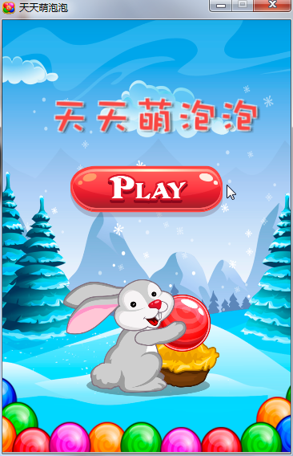
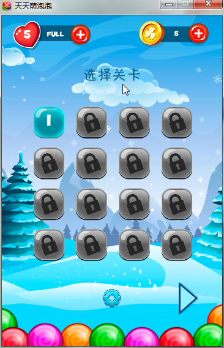
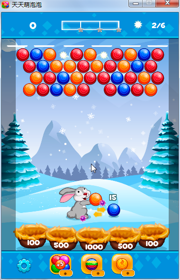
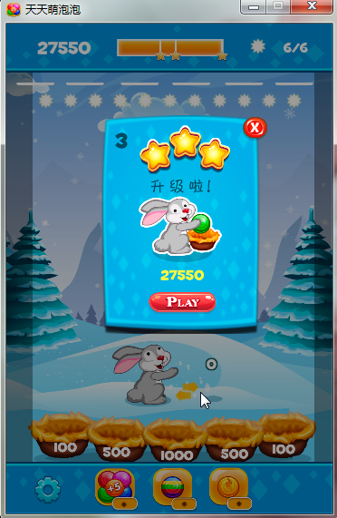
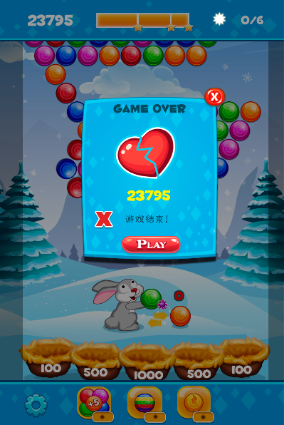
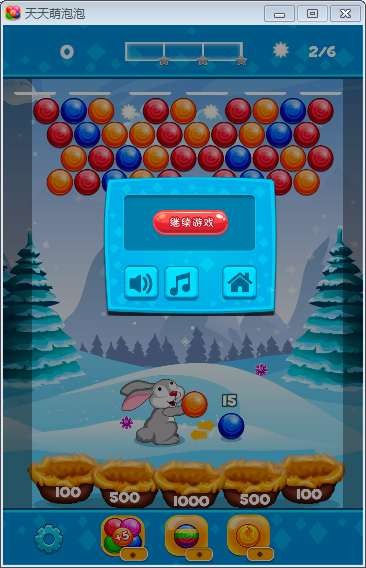
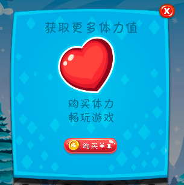
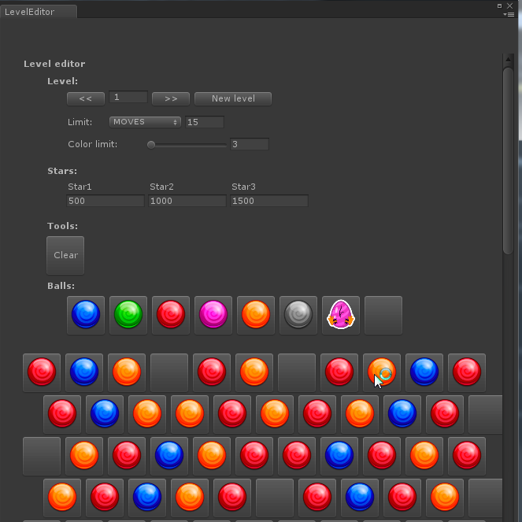
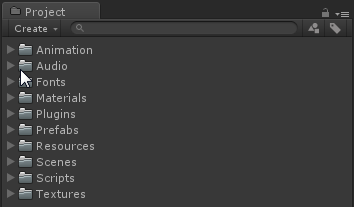
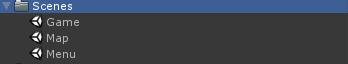

## 天天萌泡泡(BubbleShooter)

### 简介  
天天萌泡泡，一款以泡泡龙为主题的三消游戏

### 游戏下载  
* [Windows平台](http://pan.baidu.com/s/1dFpPZvb) 密码：lu3d
* [Android平台](http://pan.baidu.com/s/1i47I1Gp) 密码：5j4p

### 游戏演示  
  
 
  
  
  

### 项目手册  
* 开发环境：Unity2018.2.13 & VS2017 
* 项目结构:  
  * 工程目录结构划分：  
  
  * 游戏分为3个场景：  
  
Game是游戏的主场景  
Map是游戏的关卡选择和设置场景  
Menu是游戏的开始欢迎场景  
  * 游戏支持关卡编辑器功能，如上图，可以可视化的进行关卡编辑，编辑的关卡文件将以.txt的形式保存在本地，理论上支持无线关卡  
  * 游戏内有体力购买以及道具商店，已经预留好支付接口，接入相应支付平台即可使用  

未完待续...

